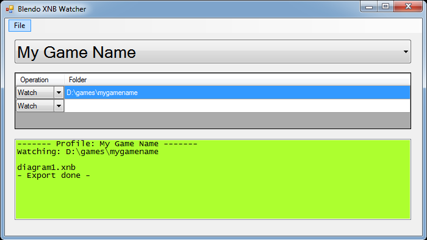

# Blendo XNB Watcher
 

## About
This is a tool that converts textures/models/sound/font/etc assets into the XNB file format (for the [FNA](https://fna-xna.github.io) game framework). XNB Watcher will detect when files are added or modified in a specific folder, and will automatically convert the file to XNB format without any action required from you.

This is written in C# and a .sln solution for Visual Studio 2010 is provided. Windows only.

Pre-compiled binaries are available at [my itch.io page](https://blendogames.itch.io/blendo-xnb-watcher).

## License
This source code is licensed under the zlib license. Read the license details here: [LICENSE.md](https://github.com/blendogames/xnb_watcher/blob/master/license.md)

## Credits
Created by [Brendon Chung](http://blendogames.com)

Uses code from [XNB Builder](https://sourceforge.net/projects/xnbbuilder)

## Libraries used
- [Json.NET](https://www.newtonsoft.com/json)
- [XNBBuilder](https://sourceforge.net/projects/xnbbuilder)
